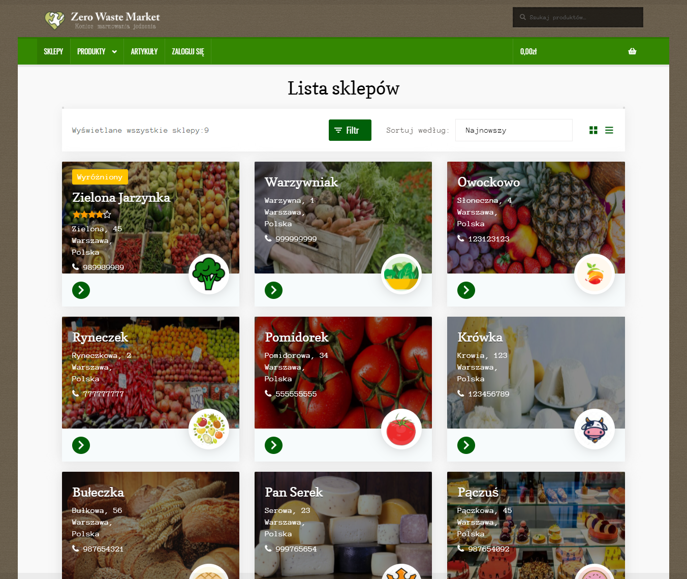
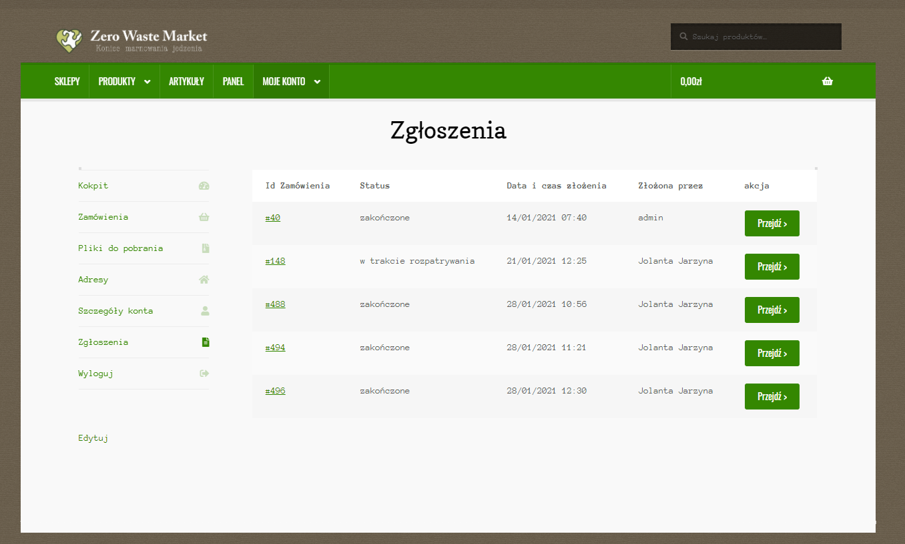
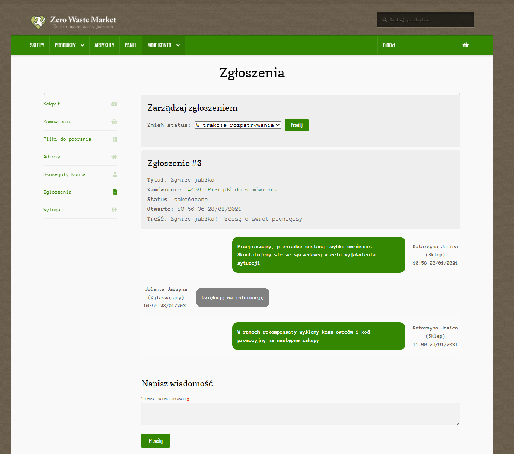
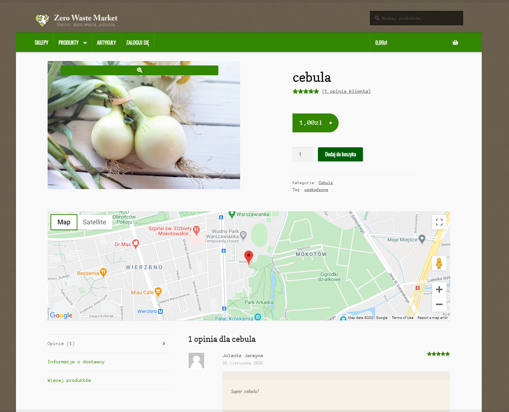
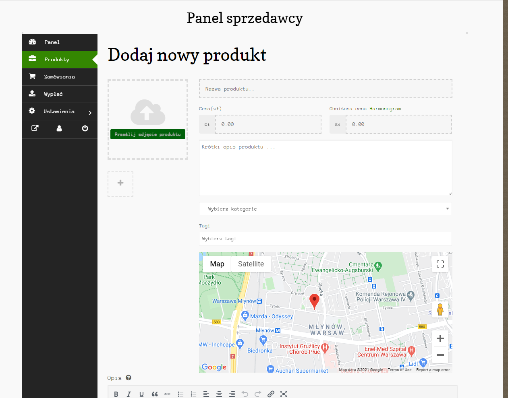

# Polish-Japanese Acedemy of Information Technology
# Course: Content Management Systems
Project: A website that allows you to sell food products with a short expiry date, damaged etc.

# Functional requirements

* making the offer of products with defects or with a near expiry date available by various sellers ✓
* Complaints possible ✓
* Each seller can administer his own offers ✓
* The users are both shoppers and the shops themselves ✓
* The customer can view offers and make a purchase ✓
* The customer can rate the product and comment ✓
* Product information includes: price, category, condition, quantity, photo, seller and location ✓
* Depending on the role, the user has different permissions ✓

# Plugins
## Own plugins
* Complaint system: A plugin that allows customers to report complaints about orders and have a conversation with vendor.
```
plugins/complaint-system
```


* Location map: Plugin that displays the location of the product.
```
plugins/location
```



# Plugins from store
* WooCommerce
* WooCommerce PayPal Checkout Gateway
* Dokan
* Nav Menu Roles
* Widget Logic
* Disable Woocommerce Logout Confirmation
* Simple CSS
* Loco Translate

# Important note
This plugin was written with no best practises of writing code in PHP&Wordpress. Please be aware that plugins might be vulnerable. 
